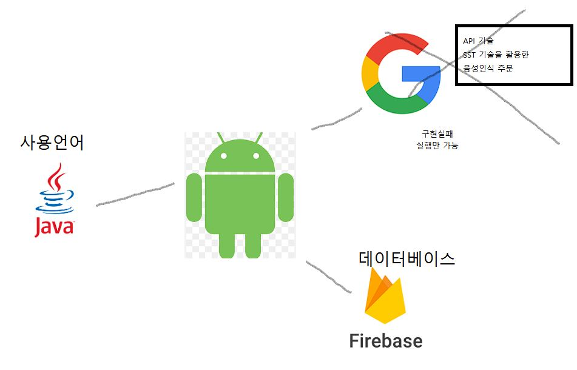
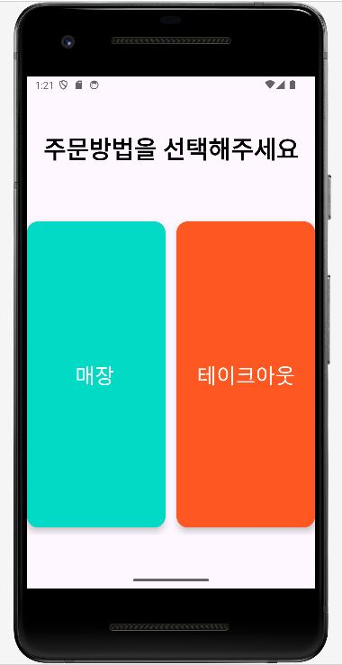
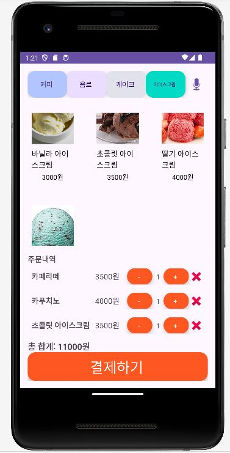
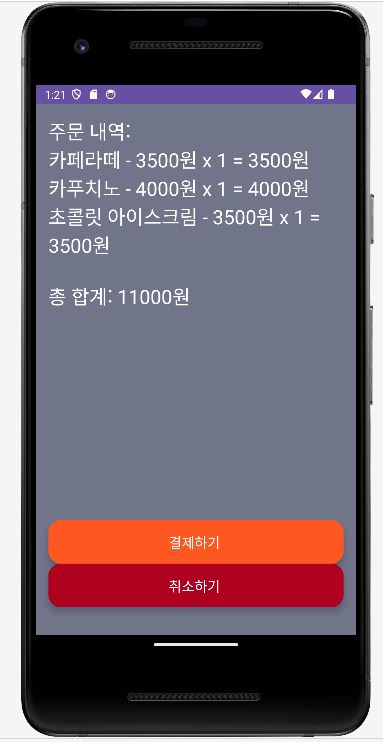
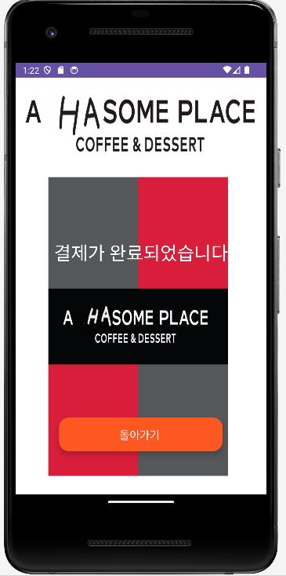
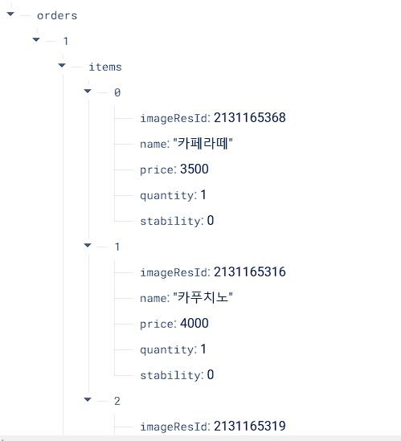

# 1. 프로젝트 HASOME PLACE

## 1.1 프로젝트 소개
카페 키오스크 어플리케이션 

## 1.2 프로젝트 배경
현대 사회에서 비대면 서비스의 중요성이 증가하고 있으며, 특히 카페와 같은 외식 업계에서는 신속하고 효율적인 주문 시스템이 필요합니다. 많은 사람들이 바쁜 일상 속에서 빠르고 편리하게 주문을 하고 싶어하지만, 줄을 서거나 직원과의 직접적인 대면을 꺼려하는 경우가 많습니다. 이러한 문제점을 해결하기 위해 사용자가 손쉽게 주문할 수 있는 키오스크 어플리케이션을 개발하게 되었습니다.

## 1.3 프로젝트 목표
편리한 주문 시스템 구축
사용자가 카페 메뉴를 쉽게 선택하고 주문할 수 있도록 직관적인 UI/UX 제공.
다양한 주문 방식 제공
매장 내에서 식사와 테이크아웃 주문 기능 제공.
주문 관리 효율성 향상
실시간으로 주문 내역을 파악하고, 관리할 수 있는 기능 제공.
# 2. 프로젝트 개요
## 2.1 프로젝트 설명
"Hasome"은 사용자가 간편하게 카페 메뉴를 선택하고 주문할 수 있는 키오스크 어플리케이션입니다. 매장 내에서 식사하거나 테이크아웃 주문을 할 수 있으며, 주문 내역은 실시간으로 관리되고 파이어베이스를 통해 저장됩니다.

## 2.2 주요 기능
* 메뉴 선택 및 주문 기능
* 사용자가 메뉴를 선택하고, 주문을 완료할 수 있는 기능 제공.
* 주문 내역 확인 및 결제
* 주문 내역을 확인하고 결제할 수 있는 기능 제공.
* 파이어베이스 데이터베이스 연동
* 주문 정보를 파이어베이스에 실시간으로 저장 및 관리.
* 주문번호 생성 및 표시
* 주문 완료 후 고유 주문번호를 생성하여 사용자에게 표시.
## 2.3 프로젝트 구조  

## 2.4 결과물
* 사용자가 매장 또는 테이크아웃을 선택할 수 있는 초기 화면.
* 
* 카페 메뉴를 선택하고 주문할 수 있는 화면.
* 
* 선택한 메뉴와 총 금액을 확인할 수 있는 화면.
* 
* 주문을 완료하고 결제할 수 있는 화면.
* 
* 실시간으로 주문내용이 데이터베이스로 저장되는 화면
* 
## 2.5 기대효과
사용자는 줄을 서지 않고도 빠르게 주문을 완료할 수 있어 편리함을 느낄 수 있습니다.
직원들은 주문을 효율적으로 관리할 수 있어 업무 효율성이 향상됩니다.
비대면 주문을 통해 사용자와 직원 모두의 안전을 보장할 수 있습니다.
## 2.6 관련 기술
* Firebase: 2011년 파이어베이스사가 개발하고 2014년 구글에 인수된 모바일 및 웹 애플리케이션 개발 플랫폼입니다. 구글 드라이브와 애널리틱스를 적용하여 어떤 기기에서나 개발할 수 있는 환경을 만들어 주고, 사용자들의 방문수 및 이용횟수, 광고 효과, 문제 발생 빈도 등을 알려줘서 개발자들이 쉽게 활용할 수 있도록 지원합니다. 
* Android Studio: 안드로이드는 휴대전화를 비롯한 장치를 위한 운영 체제와 미들웨어, 사용자 인터페이스, 표준 응용 프로그램을 포함하고 있는 소프트웨어 스택입니다. 안드로이드는 개발자들이 자바언어와 코틀린으로 응용 프로그램을 작성할 수 있게 하였으며, 컴파일된 바이트 코드를 구동할 수 있는 런타임 라이브러리를 제공합니다. 또한 안드로이드는 소프트웨어 개발 키트를 통해 응용 프로그램을 개발하기 위해 필요한 각종 도구들과 응용 프로그램 프로그래밍 인터페이스(API)를 제공합니다.
